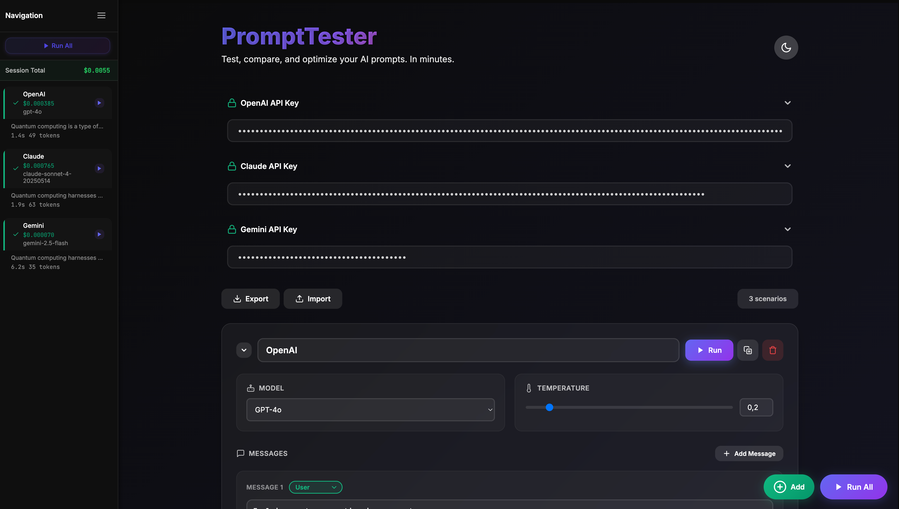

# PromptTester



Test and compare LLM prompts across OpenAI, Claude, and Gemini with real-time cost tracking.

## Features

- **Multi-Provider**: OpenAI (GPT-4/5), Claude (Opus/Sonnet), Gemini (Pro/Flash)
- **Batch Testing**: Run multiple scenarios simultaneously
- **Cost Tracking**: Real-time pricing with token usage
- **Comparison Mode**: Side-by-side response comparison
- **Import/Export**: Share scenarios as JSON

## Quick Start

```bash
# Install dependencies
npm install

# Copy and configure environment variables
cp .env.example .env
# Edit .env and add your API keys

# Start the app
npm start
```

1. Configure API keys in `.env` file
2. Create test scenarios
3. Run and compare results

## Configuration

API keys are loaded from environment variables for security. Create a `.env` file based on `.env.example`:

```
REACT_APP_OPENAI_API_KEY=your-openai-key
REACT_APP_CLAUDE_API_KEY=your-claude-key  
REACT_APP_GEMINI_API_KEY=your-gemini-key
```

## How It Works

The app uses official SDKs to connect directly to each provider. It automatically handles role conversion between different APIs (e.g., OpenAI's "developer" → Claude's "user") and calculates costs based on each provider's pricing structure.

## License

MIT